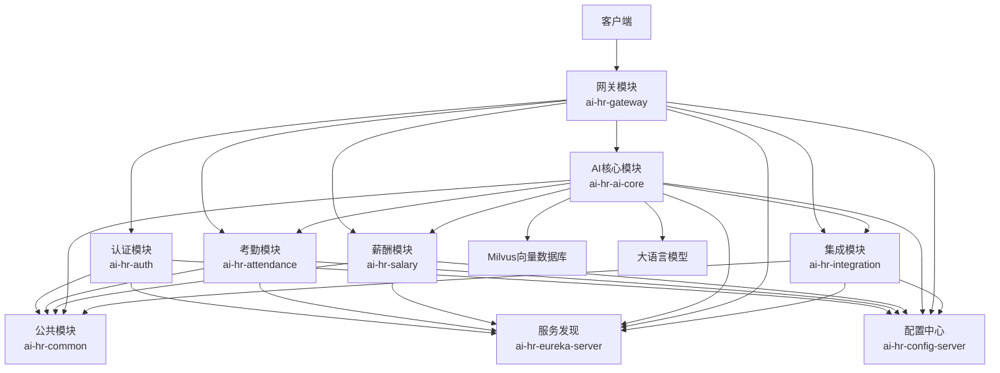

# 文档场景归纳整理

本文档按场景对项目中的所有md文件进行归纳整理，便于查阅和使用。

## 1. 项目分析与规划

### 1.1 项目概述
- **项目名称**：AI HR System
- **项目描述**：企业级AI HR智能系统，集成考勤和薪酬管理功能，使用Spring AI Alibaba实现智能分析和决策
- **技术栈**：
  - Spring Boot 3.3.6
  - Spring Cloud 2023.0.4
  - Spring AI Alibaba 1.0.0-M6.1
  - Milvus 2.6.14 (向量数据库)
  - JWT认证
  - Eureka服务发现
  - Config Server

### 1.2 模块结构

| 模块名称 | 主要功能 | 目录位置 |
|---------|---------|---------|
| ai-hr-common | 公共功能和工具类 | E:\workspace\idea\irsAi\ai-hr-common |
| ai-hr-auth | 用户认证和授权 | E:\workspace\idea\irsAi\ai-hr-auth |
| ai-hr-gateway | 请求路由和安全 | E:\workspace\idea\irsAi\ai-hr-gateway |
| ai-hr-attendance | 考勤管理 | E:\workspace\idea\irsAi\ai-hr-attendance |
| ai-hr-salary | 薪酬管理 | E:\workspace\idea\irsAi\ai-hr-salary |
| ai-hr-ai-core | AI核心功能 | E:\workspace\idea\irsAi\ai-hr-ai-core |
| ai-hr-integration | 外部系统集成 | E:\workspace\idea\irsAi\ai-hr-integration |
| ai-hr-config-server | 配置中心 | E:\workspace\idea\irsAi\ai-hr-config-server |
| ai-hr-eureka-server | 服务注册与发现 | E:\workspace\idea\irsAi\ai-hr-eureka-server |

### 1.3 项目亮点
1. **一体化HR解决方案**：集成考勤和薪酬管理，提供完整的HR管理功能
2. **AI智能赋能**：智能聊天、策略RAG、考勤AI功能、薪酬AI功能
3. **微服务架构**：采用Spring Cloud微服务架构，具有良好的可扩展性和维护性
4. **技术栈先进**：使用Spring Boot 3.3.6、Spring Cloud 2023.0.4、Spring AI Alibaba等最新技术
5. **安全性设计**：完善的认证授权机制，审计日志记录，保障系统安全
6. **可配置性**：通过Config Server实现集中配置管理，提高系统灵活性
7. **代码质量**：经过多次优化，代码质量得到显著提升

## 2. 业务场景与需求

### 2.1 考勤管理场景

#### 2.1.1 规则管理
- **功能**：创建和管理考勤规则集
- **场景**：HR管理员定义公司的考勤规则，包括迟到、早退、缺勤等判定标准
- **实现**：通过 `AttendanceController.createRuleSet()` 接口实现

#### 2.1.2 打卡记录管理
- **功能**：录入和更新员工打卡记录
- **场景**：员工通过考勤系统打卡，或管理员手动录入打卡数据
- **实现**：通过 `AttendanceController.upsertRecord()` 接口实现

#### 2.1.3 异常计算
- **功能**：计算员工的考勤异常
- **场景**：HR定期计算员工的考勤异常情况，如迟到、早退、缺勤等
- **实现**：通过 `AttendanceController.compute()` 接口实现

#### 2.1.4 异常查询
- **功能**：查询员工的考勤异常记录
- **场景**：HR或管理者查询员工的考勤异常情况
- **实现**：通过 `AttendanceController.listAnomalies()` 接口实现

#### 2.1.5 移动端打卡
- **功能**：支持员工通过移动端进行打卡
- **场景**：员工通过手机APP进行GPS定位打卡或Wi-Fi打卡
- **实现**：通过 `AttendanceController.mobileCheckin()` 接口实现

#### 2.1.6 移动端考勤查询
- **功能**：支持员工通过移动端查询考勤记录
- **场景**：员工通过手机APP查询自己的考勤记录
- **实现**：通过 `AttendanceController.mobileQuery()` 接口实现

### 2.2 薪酬管理场景

#### 2.2.1 策略管理
- **功能**：创建和管理薪酬计算策略
- **场景**：HR管理员定义公司的薪酬计算规则，包括基本工资、绩效、福利等
- **实现**：通过 `SalaryController.createPolicy()` 接口实现

#### 2.2.2 薪资预览
- **功能**：预览员工的薪资计算结果
- **场景**：HR或管理者在正式发薪前预览员工的薪资情况
- **实现**：通过 `SalaryController.previewEmployee()` 接口实现

#### 2.2.3 薪资明细查询
- **功能**：查询薪资计算的详细结果
- **场景**：HR或员工查询薪资计算的具体明细
- **实现**：通过 `SalaryController.getRunLines()` 接口实现

#### 2.2.4 税务计算
- **功能**：自动计算税费，确保符合税务法规
- **场景**：HR在计算薪资时自动计算个人所得税、社会保险费、住房公积金等
- **实现**：通过 `TaxCalculator` 服务实现

### 2.3 AI智能场景

#### 2.3.1 智能聊天
- **功能**：与AI进行人力资源相关的对话
- **场景**：员工或管理者通过聊天方式咨询HR相关问题
- **实现**：通过 `AiController.chat()` 接口实现

#### 2.3.2 策略RAG
- **功能**：将政策文档导入向量数据库并进行检索
- **场景**：HR导入公司政策文档，AI可以基于这些文档回答问题
- **实现**：通过 `AiController.ingest()` 接口实现

#### 2.3.3 考勤AI功能
- **排班优化**：智能优化员工排班
- **异常检测**：自动检测考勤异常
- **请假审批**：智能审批请假申请
- **工时预测**：预测员工工时需求

#### 2.3.4 薪酬AI功能
- **薪资调整建议**：智能建议薪资调整方案
- **税务优化**：优化税务筹划
- **薪资预测**：预测员工薪资趋势
- **薪资异常检测**：检测薪资计算异常

#### 2.3.5 模型微调
- **功能**：允许用户上传训练数据，对AI模型进行微调
- **场景**：HR根据企业特定数据对AI模型进行定制化训练
- **实现**：通过 `ModelController.fineTuneModel()` 接口实现

#### 2.3.6 模型监控
- **功能**：实时监控AI模型的性能和健康状态
- **场景**：管理员监控AI模型的运行状态和性能指标
- **实现**：通过 `ModelController.getModelMetrics()`、`ModelController.getPerformanceHistory()`、`ModelController.getModelHealthStatus()` 接口实现

### 2.4 系统集成场景

#### 2.4.1 ERP系统集成
- **功能**：与ERP系统同步员工数据
- **场景**：HR系统与企业ERP系统集成，实现数据同步
- **实现**：通过 `IntegrationController.syncWithERP()` 和 `IntegrationController.getEmployeeFromERP()` 接口实现

#### 2.4.2 CRM系统集成
- **功能**：与CRM系统同步员工数据
- **场景**：HR系统与企业CRM系统集成，实现数据同步
- **实现**：通过 `IntegrationController.syncWithCRM()` 和 `IntegrationController.getEmployeeFromCRM()` 接口实现

## 3. 系统架构与技术

### 3.1 系统架构

### 3.2 核心技术组件

| 组件名称 | 技术实现 | 功能描述 | 应用模块 |
|---------|---------|---------|---------|
| 服务注册与发现 | Eureka | 服务实例注册与发现 | 所有模块 |
| 配置管理 | Config Server | 集中管理配置信息 | 所有模块 |
| API网关 | Spring Cloud Gateway | 请求路由和安全 | ai-hr-gateway |
| 认证授权 | JWT | 用户认证和授权 | ai-hr-auth |
| 数据持久化 | Spring Data JPA | 数据库操作 | 考勤、薪酬、认证模块 |
| 向量数据库 | Milvus | 存储和检索向量数据 | ai-hr-ai-core |
| AI集成 | Spring AI Alibaba | 集成大语言模型 | ai-hr-ai-core |
| 消息队列 | RabbitMQ | 异步消息处理 | 考勤、薪酬模块 |
| 规则引擎 | 自定义实现 | 处理考勤规则和薪酬计算 | 考勤、薪酬模块 |
| 审计日志 | 自定义实现 | 记录操作审计日志 | 所有模块 |
| 输入验证 | 自定义实现 | 防止XSS、SQL注入等攻击 | 所有模块 |
| 税务计算 | 自定义实现 | 计算个人所得税、社会保险费等 | 薪酬模块 |
| 模型微调 | 自定义实现 | 对AI模型进行微调 | ai-hr-ai-core |
| 模型监控 | 自定义实现 | 监控AI模型的性能和健康状态 | ai-hr-ai-core |
| 系统集成 | RestTemplate | 与外部系统集成 | ai-hr-integration |

### 3.3 技术栈
- **后端**：Spring Boot 3.3.6、Spring Cloud 2023.0.4
- **AI**：Spring AI Alibaba 1.0.0-M6.1
- **数据库**：MySQL 8.0+、Milvus 2.6.14+
- **缓存**：Redis 6.0+
- **认证**：JWT
- **服务注册与发现**：Eureka
- **配置管理**：Config Server
- **消息队列**：RabbitMQ

## 4. 优化与改进

### 4.1 代码结构和可维护性
- **模块化重构**：进一步优化模块间的依赖关系，减少循环依赖
- **接口标准化**：统一各模块的接口设计标准，提高代码一致性
- **代码复用**：继续提取公共组件，减少代码重复
- **命名规范**：统一变量、方法和类的命名规范，提高代码可读性
- **代码注释**：添加详细的代码注释，特别是复杂业务逻辑部分

### 4.2 性能优化
- **缓存策略**：添加缓存机制，减少重复计算和数据库查询
- **数据库优化**：进一步优化数据库查询，添加更多索引
- **异步处理**：对更多耗时操作采用异步处理
- **资源管理**：优化线程池和连接池配置
- **内存使用**：优化内存使用，减少内存泄漏风险

### 4.3 安全性
- **权限控制**：细化权限控制粒度，实现更细的权限管理
- **数据加密**：对敏感数据进行加密存储和传输
- **安全审计**：加强安全审计机制，记录所有关键操作
- **漏洞防护**：定期进行安全扫描，修复潜在漏洞
- **输入验证**：进一步加强输入验证，防止各种注入攻击

### 4.4 测试覆盖
- **单元测试**：增加单元测试覆盖率，特别是边缘场景
- **集成测试**：添加集成测试，确保模块间的正确交互
- **性能测试**：添加性能测试，确保系统在高负载下的稳定性
- **安全测试**：添加安全测试，检测潜在的安全漏洞
- **测试自动化**：实现测试自动化，提高测试效率

### 4.5 配置管理
- **配置集中化**：进一步集中配置管理，减少分散配置
- **环境配置**：完善不同环境的配置管理
- **配置监控**：添加配置变更监控和审计
- **配置验证**：添加配置验证机制，确保配置的正确性

### 4.6 文档完善
- **接口文档**：完善API接口文档，包括请求参数、响应格式等
- **架构文档**：更新系统架构文档，反映最新的系统结构
- **部署文档**：完善部署文档，包括详细的部署步骤和 troubleshooting
- **开发文档**：添加开发指南，帮助新开发人员快速上手
- **用户文档**：添加用户使用手册，指导用户如何使用系统

### 4.7 扩展性
- **插件化设计**：采用插件化架构，便于功能扩展
- **API版本控制**：实现API版本控制，便于平滑升级
- **微服务拆分**：根据业务需求，进一步拆分微服务
- **技术栈升级**：定期升级技术栈，使用最新的技术和框架
- **多租户支持**：完善多租户支持，满足不同租户的需求

### 4.8 监控和运维
- **监控体系**：完善监控体系，包括应用指标、系统指标等
- **告警机制**：配置合理的告警机制，及时发现和处理问题
- **日志管理**：优化日志管理，便于问题排查
- **灾备方案**：完善灾备方案，确保系统的高可用性
- **性能分析**：定期进行性能分析，找出性能瓶颈

### 4.9 业务功能扩展
- **功能完善**：完善现有功能，提高用户体验
- **新功能开发**：根据业务需求，开发新的功能模块
- **AI能力增强**：增强AI能力，提供更智能的服务
- **集成第三方服务**：集成更多第三方服务，扩展系统功能
- **移动化支持**：开发移动应用，提高系统的便捷性

## 5. 部署与上线

### 5.1 部署架构
- **微服务部署**：各微服务独立部署，支持水平扩展
- **容器化部署**：使用Docker容器化部署，提高部署效率和一致性
- **CI/CD**：实现持续集成和持续部署，自动化部署流程
- **环境隔离**：开发、测试、生产环境隔离，确保系统稳定性

### 5.2 部署步骤
1. **环境准备**：准备服务器环境，安装必要的软件和依赖
2. **数据库配置**：配置MySQL和Milvus数据库
3. **服务部署**：部署各个微服务，包括配置中心、服务注册与发现、网关、认证、考勤、薪酬、AI核心和集成服务
4. **服务注册**：确保所有服务正确注册到Eureka服务注册中心
5. **配置管理**：通过Config Server管理所有服务的配置
6. **监控配置**：配置监控系统，确保系统的正常运行
7. **测试验证**：进行功能测试和性能测试，确保系统的稳定性和性能
8. **上线发布**：正式上线发布系统

### 5.3 运维管理
- **监控体系**：实时监控系统的运行状态和性能指标
- **告警机制**：配置合理的告警机制，及时发现和处理问题
- **日志管理**：集中管理系统日志，便于问题排查
- **备份策略**：定期备份数据，确保数据安全
- **灾备方案**：制定完善的灾备方案，确保系统的高可用性
- **性能优化**：定期进行性能分析和优化，提高系统性能

## 6. 总结

通过对项目文档的场景归纳整理，我们可以清晰地了解AI HR系统的整体架构、功能模块、技术实现和优化方向。系统已经实现了考勤管理、薪酬管理、AI智能和系统集成等核心功能，并且在不断优化和改进中。

未来，系统将继续增强AI能力，扩展业务功能，优化系统性能，提高用户体验，为企业提供更智能、更高效的人力资源管理解决方案。
