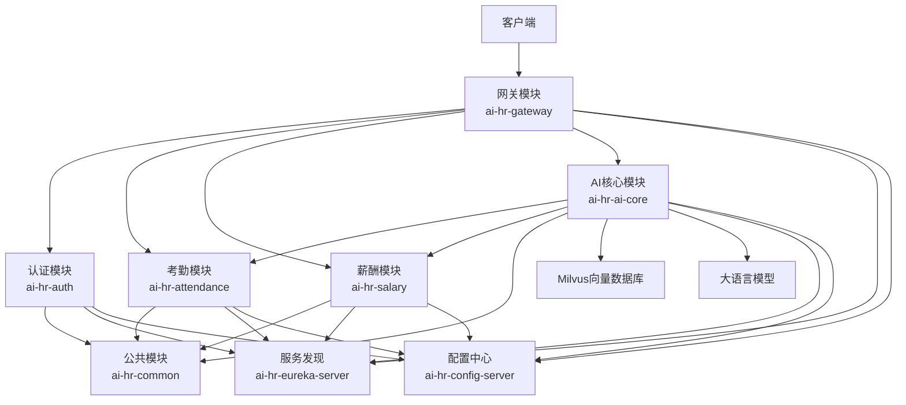

# 项目业务与代码分析文档

## 1. 项目概述

### 1.1 项目基本信息

- **项目名称**：AI HR System
- **项目描述**：企业级AI HR智能系统，集成考勤和薪酬管理功能，使用Spring AI Alibaba实现智能分析和决策
- **技术栈**：
  - Spring Boot 3.3.6
  - Spring Cloud 2023.0.4
  - Spring AI Alibaba 1.0.0-M6.1
  - Milvus 2.6.14 (向量数据库)
  - JWT认证
  - Eureka服务发现
  - Config Server

### 1.2 模块结构

| 模块名称             | 主要功能     | 目录位置                                     |
| ---------------- | -------- | ---------------------------------------- |
| ai-hr-common     | 公共功能和工具类 | E:\workspace\idea\irsAi\ai-hr-common     |
| ai-hr-auth       | 用户认证和授权  | E:\workspace\idea\irsAi\ai-hr-auth       |
| ai-hr-gateway    | 请求路由和安全  | E:\workspace\idea\irsAi\ai-hr-gateway    |
| ai-hr-attendance | 考勤管理     | E:\workspace\idea\irsAi\ai-hr-attendance |
| ai-hr-salary     | 薪酬管理     | E:\workspace\idea\irsAi\ai-hr-salary     |
| ai-hr-ai-core    | AI核心功能   | E:\workspace\idea\irsAi\ai-hr-ai-core    |

## 2. 业务场景覆盖

### 2.1 考勤管理场景

#### 2.1.1 规则管理

- **功能**：创建和管理考勤规则集
- **场景**：HR管理员定义公司的考勤规则，包括迟到、早退、缺勤等判定标准
- **实现**：通过 `AttendanceController.createRuleSet()` 接口实现

#### 2.1.2 打卡记录管理

- **功能**：录入和更新员工打卡记录
- **场景**：员工通过考勤系统打卡，或管理员手动录入打卡数据
- **实现**：通过 `AttendanceController.upsertRecord()` 接口实现

#### 2.1.3 异常计算

- **功能**：计算员工的考勤异常
- **场景**：HR定期计算员工的考勤异常情况，如迟到、早退、缺勤等
- **实现**：通过 `AttendanceController.compute()` 接口实现

#### 2.1.4 异常查询

- **功能**：查询员工的考勤异常记录
- **场景**：HR或管理者查询员工的考勤异常情况
- **实现**：通过 `AttendanceController.listAnomalies()` 接口实现

### 2.2 薪酬管理场景

#### 2.2.1 策略管理

- **功能**：创建和管理薪酬计算策略
- **场景**：HR管理员定义公司的薪酬计算规则，包括基本工资、绩效、福利等
- **实现**：通过 `SalaryController.createPolicy()` 接口实现

#### 2.2.2 薪资预览

- **功能**：预览员工的薪资计算结果
- **场景**：HR或管理者在正式发薪前预览员工的薪资情况
- **实现**：通过 `SalaryController.previewEmployee()` 接口实现

#### 2.2.3 薪资明细查询

- **功能**：查询薪资计算的详细结果
- **场景**：HR或员工查询薪资计算的具体明细
- **实现**：通过 `SalaryController.getRunLines()` 接口实现

### 2.3 AI智能场景

#### 2.3.1 智能聊天

- **功能**：与AI进行人力资源相关的对话
- **场景**：员工或管理者通过聊天方式咨询HR相关问题
- **实现**：通过 `AiController.chat()` 接口实现

#### 2.3.2 策略RAG

- **功能**：将政策文档导入向量数据库并进行检索
- **场景**：HR导入公司政策文档，AI可以基于这些文档回答问题
- **实现**：通过 `AiController.ingest()` 接口实现

#### 2.3.3 考勤AI功能

- **排班优化**：智能优化员工排班
- **异常检测**：自动检测考勤异常
- **请假审批**：智能审批请假申请
- **工时预测**：预测员工工时需求

#### 2.3.4 薪酬AI功能

- **薪资调整建议**：智能建议薪资调整方案
- **税务优化**：优化税务筹划
- **薪资预测**：预测员工薪资趋势
- **薪资异常检测**：检测薪资计算异常

## 3. 代码分析

### 3.1 考勤模块代码分析

#### 3.1.1 AttendanceController

- **主要接口**：
  - `createRuleSet()`：创建考勤规则集
  - `upsertRecord()`：写入/更新打卡记录
  - `compute()`：计算考勤异常
  - `listAnomalies()`：查询异常列表
- **核心业务逻辑**：
  - 规则集管理：支持创建和管理考勤规则
  - 打卡记录管理：支持录入和更新员工打卡数据
  - 异常计算：基于规则集计算考勤异常
  - 异常查询：支持按员工和时间范围查询异常

#### 3.1.2 AttendanceService

- **主要方法**：
  - `createRuleSet()`：创建规则集
  - `upsertRecord()`：更新打卡记录
  - `computeAnomalies()`：计算异常
  - `listAnomalies()`：查询异常
- **核心业务逻辑**：
  - 规则引擎：使用 `AttendanceRuleEngine` 处理考勤规则
  - 数据持久化：使用 `AttendanceRuleSetRepository`、`AttendanceRecordRepository` 等进行数据存储
  - 异常检测：基于规则集和打卡记录检测异常
  - 输入验证：使用 `InputValidator` 进行输入验证

### 3.2 薪酬模块代码分析

#### 3.2.1 SalaryController

- **主要接口**：
  - `createPolicy()`：创建薪酬策略
  - `previewEmployee()`：预览员工薪资
  - `getRunLines()`：查询薪资明细
- **核心业务逻辑**：
  - 策略管理：支持创建和管理薪酬计算策略
  - 薪资预览：基于策略和输入数据预览薪资结果
  - 明细查询：查询薪资计算的详细结果

#### 3.2.2 SalaryService

- **主要方法**：
  - `createPolicy()`：创建薪酬策略
  - `previewEmployee()`：预览员工薪资
  - `getRunLines()`：查询薪资明细
- **核心业务逻辑**：
  - 策略管理：存储和管理薪酬计算策略
  - 薪资计算：使用 `SalaryPolicyCalculator` 计算薪资
  - 数据持久化：使用 `SalaryPolicyRepository`、`SalaryCalcRunRepository` 等进行数据存储
  - 输入验证：使用 `InputValidator` 进行输入验证

### 3.3 AI核心模块代码分析

#### 3.3.1 AiController

- **主要接口**：
  - `chat()`：智能聊天
  - `ingest()`：导入政策文档
  - 考勤AI接口：排班优化、异常检测、请假审批、工时预测
  - 薪酬AI接口：薪资调整建议、税务优化、薪资预测、薪资异常检测
- **核心业务逻辑**：
  - 聊天处理：使用 `ChatApplicationService` 处理聊天请求
  - 政策RAG：使用 `PolicyRagService` 处理政策文档导入和检索
  - 考勤AI：使用 `AttendanceAIService` 处理考勤相关AI功能
  - 薪酬AI：使用 `SalaryAIService` 处理薪酬相关AI功能

#### 3.3.2 ChatApplicationService

- **核心业务逻辑**：
  - 会话管理：管理聊天会话
  - 消息处理：处理用户消息
  - 工具调用：调用相关工具处理特定任务
  - 响应生成：生成AI响应
  - 输入验证：使用 `InputValidator` 进行输入验证

#### 3.3.3 PolicyRagService

- **核心业务逻辑**：
  - 文档导入：将政策文档导入向量数据库
  - 向量检索：基于用户查询检索相关文档片段
  - 文档管理：管理导入的政策文档
  - 异步处理：使用 `ExecutorService` 进行异步处理

## 4. 业务流程走读

### 4.1 考勤管理流程

#### 4.1.1 规则集创建流程

1. **请求发起**：HR管理员调用 `POST /v1/attendance/rule-sets` 接口
2. **参数验证**：验证规则集名称、版本、生效日期等参数
3. **规则存储**：将规则集保存到数据库
4. **审计记录**：记录操作审计日志
5. **返回结果**：返回规则集ID

#### 4.1.2 打卡记录录入流程

1. **请求发起**：员工打卡或管理员调用 `POST /v1/attendance/records` 接口
2. **参数验证**：验证员工ID、工作日期、打卡时间等参数
3. **记录存储**：将打卡记录保存到数据库（支持更新）
4. **审计记录**：记录操作审计日志
5. **返回结果**：返回记录ID

#### 4.1.3 异常计算流程

1. **请求发起**：HR调用 `POST /v1/attendance/anomalies/compute` 接口
2. **参数验证**：验证员工ID、计算区间、规则集ID等参数
3. **规则获取**：获取指定的规则集（或默认规则集）
4. **记录获取**：获取员工在指定区间的打卡记录
5. **异常计算**：基于规则集和打卡记录计算异常
6. **异常存储**：将计算出的异常保存到数据库
7. **审计记录**：记录操作审计日志
8. **返回结果**：返回计算结果，包含快照ID和异常数量

#### 4.1.4 异常查询流程

1. **请求发起**：HR或管理者调用 `GET /v1/attendance/anomalies` 接口
2. **参数验证**：验证员工ID、开始日期、结束日期等参数
3. **异常查询**：从数据库查询指定员工在指定区间的异常记录
4. **结果转换**：将异常记录转换为响应格式
5. **返回结果**：返回异常列表

### 4.2 薪酬管理流程

#### 4.2.1 策略创建流程

1. **请求发起**：HR管理员调用 `POST /v1/salary/policies` 接口
2. **参数验证**：验证策略名称、版本、生效日期等参数
3. **策略存储**：将策略保存到数据库
4. **审计记录**：记录操作审计日志
5. **返回结果**：返回策略ID

#### 4.2.2 薪资预览流程

1. **请求发起**：HR调用 `POST /v1/salary/preview/employee` 接口
2. **参数验证**：验证计薪周期、员工ID、输入数据等参数
3. **策略获取**：获取指定的策略（或默认策略）
4. **输入存储**：将输入数据保存为快照
5. **薪资计算**：基于策略和输入数据计算薪资
6. **结果存储**：将计算结果保存到数据库
7. **审计记录**：记录操作审计日志
8. **返回结果**：返回计算结果，包含计算运行ID、策略信息、输入快照ID、结果哈希和明细

#### 4.2.3 薪资明细查询流程

1. **请求发起**：HR或员工调用 `GET /v1/salary/runs/lines` 接口
2. **参数验证**：验证计算运行ID
3. **明细查询**：从数据库查询指定计算运行的明细行
4. **结果转换**：将明细行转换为响应格式
5. **返回结果**：返回明细列表

### 4.3 AI功能流程

#### 4.3.1 智能聊天流程

1. **请求发起**：用户调用 `POST /v1/ai/chat` 接口
2. **参数验证**：验证会话ID、消息内容等参数
3. **会话管理**：获取或创建会话
4. **消息处理**：处理用户消息
5. **工具调用**：根据需要调用相关工具
6. **响应生成**：生成AI响应
7. **返回结果**：返回聊天响应

#### 4.3.2 政策文档导入流程

1. **请求发起**：HR调用 `POST /v1/ai/policy/ingest` 接口
2. **参数验证**：验证文档类型、标题、版本、生效日期等参数
3. **文档处理**：处理文档片段
4. **向量存储**：将文档片段存储到向量数据库
5. **返回结果**：返回文档ID

#### 4.3.3 考勤AI功能流程

1. **排班优化**：
   - 请求发起：调用 `POST /v1/ai/attendance/scheduling` 接口
   - 参数验证：验证请求参数
   - 优化计算：基于AI算法优化排班
   - 返回结果：返回优化后的排班方案
2. **异常检测**：
   - 请求发起：调用 `POST /v1/ai/attendance/anomalies/detect` 接口
   - 参数验证：验证请求参数
   - 异常检测：基于AI算法检测考勤异常
   - 返回结果：返回检测结果
3. **请假审批**：
   - 请求发起：调用 `POST /v1/ai/attendance/leave/approve` 接口
   - 参数验证：验证请求参数
   - 审批分析：基于AI算法分析请假请求
   - 返回结果：返回审批建议
4. **工时预测**：
   - 请求发起：调用 `POST /v1/ai/attendance/workhours/predict` 接口
   - 参数验证：验证请求参数
   - 预测计算：基于AI算法预测工时需求
   - 返回结果：返回预测结果

#### 4.3.4 薪酬AI功能流程

1. **薪资调整建议**：
   - 请求发起：调用 `POST /v1/ai/salary/adjustment/suggest` 接口
   - 参数验证：验证请求参数
   - 建议分析：基于AI算法分析薪资调整建议
   - 返回结果：返回调整建议
2. **税务优化**：
   - 请求发起：调用 `POST /v1/ai/salary/tax/optimize` 接口
   - 参数验证：验证请求参数
   - 优化计算：基于AI算法优化税务筹划
   - 返回结果：返回优化方案
3. **薪资预测**：
   - 请求发起：调用 `POST /v1/ai/salary/prediction` 接口
   - 参数验证：验证请求参数
   - 预测计算：基于AI算法预测薪资趋势
   - 返回结果：返回预测结果
4. **薪资异常检测**：
   - 请求发起：调用 `POST /v1/ai/salary/anomalies/detect` 接口
   - 参数验证：验证请求参数
   - 异常检测：基于AI算法检测薪资计算异常
   - 返回结果：返回检测结果

## 5. 技术架构分析

### 5.1 系统架构

### 5.2 核心技术组件

| 组件名称    | 技术实现                 | 功能描述           | 应用模块          |
| ------- | -------------------- | -------------- | ------------- |
| 服务注册与发现 | Eureka               | 服务实例注册与发现      | 所有模块          |
| 配置管理    | Config Server        | 集中管理配置信息       | 所有模块          |
| API网关   | Spring Cloud Gateway | 请求路由和安全        | ai-hr-gateway |
| 认证授权    | JWT                  | 用户认证和授权        | ai-hr-auth    |
| 数据持久化   | Spring Data JPA      | 数据库操作          | 考勤、薪酬、认证模块    |
| 向量数据库   | Milvus               | 存储和检索向量数据      | ai-hr-ai-core |
| AI集成    | Spring AI Alibaba    | 集成大语言模型        | ai-hr-ai-core |
| 消息队列    | RabbitMQ             | 异步消息处理         | 考勤、薪酬模块       |
| 规则引擎    | 自定义实现                | 处理考勤规则和薪酬计算    | 考勤、薪酬模块       |
| 审计日志    | 自定义实现                | 记录操作审计日志       | 所有模块          |
| 输入验证    | 自定义实现                | 防止XSS、SQL注入等攻击 | 所有模块          |

### 5.3 数据流分析

1. **用户请求流**：
   - 客户端 → 网关 → 相应业务模块 → 数据库/外部服务
2. **AI处理流**：
   - 客户端 → 网关 → AI核心模块 → 业务模块/向量数据库/LLM → 响应
3. **数据存储流**：
   - 业务模块 → 数据库
   - AI核心模块 → 向量数据库
4. **服务间调用流**：
   - AI核心模块 → 考勤模块/薪酬模块
   - 各业务模块 → 公共模块

## 6. 代码质量与优化建议

### 6.1 代码质量评估

1. **优点**：
   - 模块化设计：清晰的模块划分，职责明确
   - 接口规范：RESTful API设计，参数验证完善
   - 异常处理：全局异常处理机制
   - 审计日志：完善的审计日志记录
   - 测试覆盖：核心功能有单元测试
   - 代码优化：已完成多项代码优化，包括移除重复模块、统一包路径、提取公共功能等
2. **改进空间**：
   - 文档完善：部分接口和方法缺少详细文档
   - 错误处理：部分错误处理可以更详细

### 6.2 优化建议

1. **代码结构优化**：
   - 模块化重构：进一步优化模块间的依赖关系
   - 接口标准化：统一各模块的接口设计标准
2. **性能优化**：
   - 缓存策略：添加缓存机制，减少重复计算
3. **安全性优化**：
   - 权限控制：细化权限控制粒度
   - 数据加密：对敏感数据进行加密存储
   - 安全审计：加强安全审计机制
4. **可维护性优化**：
   - 文档完善：补充接口和方法文档
   - 日志优化：完善日志记录，便于问题排查
   - 测试覆盖：增加测试覆盖率，特别是边缘场景
5. **扩展性优化**：
   - 插件化设计：采用插件化架构，便于功能扩展
   - API版本控制：实现API版本控制，便于平滑升级

## 7. 总结与亮点回顾

### 7.1 项目亮点

1. **一体化HR解决方案**：集成考勤和薪酬管理，提供完整的HR管理功能
2. **AI智能赋能**：
   - 智能聊天：提供HR相关的智能问答
   - 策略RAG：基于向量数据库实现政策文档智能检索
   - 考勤AI：排班优化、异常检测、请假审批、工时预测
   - 薪酬AI：薪资调整建议、税务优化、薪资预测、薪资异常检测
3. **微服务架构**：采用Spring Cloud微服务架构，具有良好的可扩展性和维护性
4. **技术栈先进**：使用Spring Boot 3.3.6、Spring Cloud 2023.0.4、Spring AI Alibaba等最新技术
5. **安全性设计**：完善的认证授权机制，审计日志记录，保障系统安全
6. **可配置性**：通过Config Server实现集中配置管理，提高系统灵活性
7. **代码质量**：经过多次优化，代码质量得到显著提升，包括移除重复模块、统一包路径、提取公共功能等

### 7.2 业务价值

1. **提高HR效率**：自动化考勤和薪酬管理，减少人工操作
2. **智能决策支持**：基于AI技术提供智能分析和决策建议
3. **数据驱动管理**：通过数据分析，为HR管理提供数据支持
4. **提升员工体验**：提供便捷的自助服务，如请假申请、薪资查询等
5. **降低管理成本**：减少人工操作和错误，降低管理成本

### 7.3 未来发展潜力

1. **功能扩展**：
   - 招聘管理：集成AI招聘功能
   - 培训管理：智能培训计划和评估
   - 绩效评估：AI辅助绩效评估
2. **技术升级**：
   - 更先进的AI模型：使用更强大的大语言模型
   - 实时数据分析：引入实时数据处理技术
   - 移动端支持：开发移动应用，提高便捷性
3. **生态集成**：
   - 与企业其他系统集成：ERP、CRM等
   - 第三方服务集成：社保、税务等
4. **智能化升级**：
   - 预测性分析：基于历史数据预测未来趋势
   - 自动化决策：进一步提高自动化程度
   - 个性化服务：根据员工需求提供个性化服务

***

## 8. 附录

### 8.1 核心API列表

#### 8.1.1 考勤模块API

| API路径                              | 方法   | 功能描述      |
| ---------------------------------- | ---- | --------- |
| `/v1/attendance/rule-sets`         | POST | 创建考勤规则集   |
| `/v1/attendance/records`           | POST | 写入/更新打卡记录 |
| `/v1/attendance/anomalies/compute` | POST | 计算考勤异常    |
| `/v1/attendance/anomalies`         | GET  | 查询异常列表    |

#### 8.1.2 薪酬模块API

| API路径                         | 方法   | 功能描述   |
| ----------------------------- | ---- | ------ |
| `/v1/salary/policies`         | POST | 创建薪酬策略 |
| `/v1/salary/preview/employee` | POST | 预览员工薪资 |
| `/v1/salary/runs/lines`       | GET  | 查询薪资明细 |

#### 8.1.3 AI核心模块API

| API路径                                 | 方法   | 功能描述   |
| ------------------------------------- | ---- | ------ |
| `/v1/ai/chat`                         | POST | 智能聊天   |
| `/v1/ai/policy/ingest`                | POST | 导入政策文档 |
| `/v1/ai/attendance/scheduling`        | POST | 排班优化   |
| `/v1/ai/attendance/anomalies/detect`  | POST | 考勤异常检测 |
| `/v1/ai/attendance/leave/approve`     | POST | 请假审批   |
| `/v1/ai/attendance/workhours/predict` | POST | 工时预测   |
| `/v1/ai/salary/adjustment/suggest`    | POST | 薪资调整建议 |
| `/v1/ai/salary/tax/optimize`          | POST | 税务优化   |
| `/v1/ai/salary/prediction`            | POST | 薪资预测   |
| `/v1/ai/salary/anomalies/detect`      | POST | 薪资异常检测 |

### 8.2 数据库表结构

#### 8.2.1 考勤模块表

- `attendance_rule_set`：考勤规则集
- `attendance_record`：打卡记录
- `attendance_anomaly`：考勤异常
- `attendance_snapshot`：考勤快照

#### 8.2.2 薪酬模块表

- `salary_policy`：薪酬策略
- `salary_calc_run`：薪资计算运行
- `salary_input_snapshot`：薪资输入快照
- `salary_result_line`：薪资结果明细

#### 8.2.3 认证模块表

- `user`：用户信息
- `user_role`：用户角色

#### 8.2.4 AI核心模块表

- `policy_document`：政策文档
- `policy_chunk`：政策文档片段
- `audit_event`：审计事件
- `tool_call_log`：工具调用日志

### 8.3 技术依赖

| 依赖名称              | 版本         | 用途      |
| ----------------- | ---------- | ------- |
| Spring Boot       | 3.3.6      | 应用框架    |
| Spring Cloud      | 2023.0.4   | 微服务框架   |
| Spring AI Alibaba | 1.0.0-M6.1 | AI集成    |
| Milvus SDK Java   | 2.6.14     | 向量数据库集成 |
| JWT               | -          | 认证授权    |
| Spring Data JPA   | -          | 数据持久化   |
| H2 Database       | -          | 嵌入式数据库  |
| Flyway            | -          | 数据库迁移   |
| RabbitMQ          | -          | 消息队列    |

***

**文档生成时间**：2026-03-29
**文档作者**：系统分析
